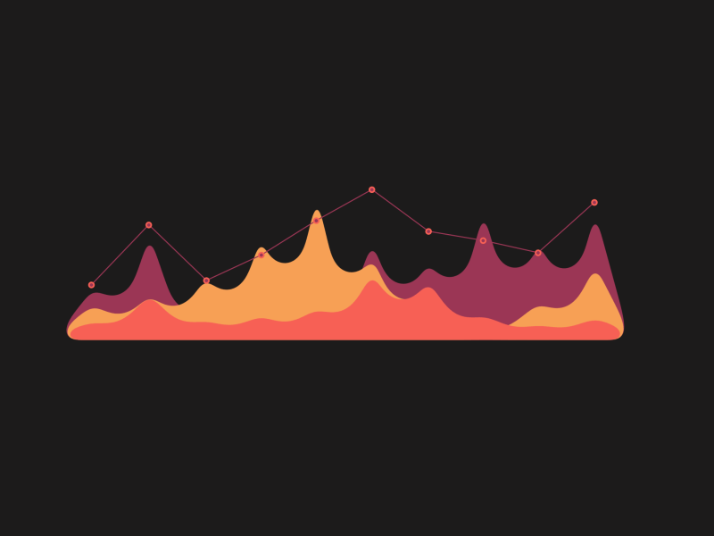

  

    

<h2 align="left">
   About Me
</h2>

Hi, I'm <strong>Prashanth Kumar G</strong> from <strong>Bangalore, India</strong>, currently pursuing my <strong>Master of Computer Applications (MCA)</strong> at <strong>MS Ramaiah Institute of Technology</strong>. I'm passionate about <strong>learning new technologies</strong>, <strong>solving logical problems</strong>, and <strong>exploring how software works</strong>. My interests include <strong>programming</strong>, <strong>data analysis</strong>, and <strong>creating user-friendly desktop and web interfaces</strong>. I’m continuously <strong>improving my skills</strong> in various <strong>programming languages and tools</strong>, and I enjoy working on <strong>academic and personal projects</strong> that challenge me to grow both <strong>technically</strong> and <strong>creatively</strong>.

    

<h2 align="left">
   Tech Stack
</h2>

  
  
  
  
  
  
  
  
  
  
  
  
  
  
  
  
  
  

  

<h2 align="left">
   Projects
</h2>

  
  
  
  
  

    

<h2 align="left">
   GitHub Stats
</h2>

  
  
  

  

<h2 align="left">
   Connect With Me
</h2>

  
  
  
  

    

  💙 If you like my projects, Give them ⭐ and Share it with friends!  
  Made with ❤️ in India
  

